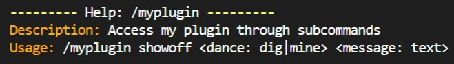
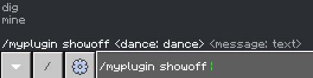

# Remark - UI for PocketMine-MP plugins

What you **WON'T** get:
* ❌ Boilerplate
* ❌ Fragile command handling
* ❌ Broken Forms

What you **WILL** get:
* ✔ Readable command handlers
* ✔ `TAB`-completion for commands in-game
* ✔ Extensible through custom parameters types

# Example




In `Plugin.php`:
```php
public function onEnable(): void
{
    // activate() and bind() should only be called once.
    Remark::activate($this); // Allows type hints to appear in-game.
    Remark::bind($this, new Commands()); // Registers the commands to the server.
}
```

In `Commands.php`:
```php
#[CmdConfig(
    name: 'myplugin',
    description: "Access my plugin through subcommands",
    aliases: [],
    permissions: ['myplugin.command']
)]
final class Commands
{
    #[Cmd('myplugin', 'showoff')]
    #[permission('myplugin.command.showoff')]
    #[sender(player: true), enum('dance', 'dig', 'mine'), raw(count: null)]
    public function showOff(Player $sender, string $dance, array $message): void
    {
        $sender->sendActionBarMessage("Dancing ($dance) - $message");
    }
}
```

# Terminology

`Remark::bind()` finds methods marked with the
`Cmd` attribute, called HandlerMethods. A
handler methods may have `Guards` and `Args`
attached to it.

## Guard
A `Guard` prevents a HandlerMethod from being
ran when a requirement isn't satisfied. I. e.
the command sender not having permission.

## Arg
An `Arg` provides a value to it's corresponding
parameter of a HandlerMethod. The number of
`Args` in a HandlerMethod must be equal to its number of parameters. An `Arg` may extract its
value from the arguments given when the command
is run, or it may get its value from another
source.

# Attributes

## CmdConfig
Configures a base slash-command, applies to
the class.
```php
string $name,
string $description,
array $aliases = [],
array $permissions = [],
```
* name - The name of the underlying command
* description - The description of the command
* aliases - The aliases of the command
* permissions - Controls what players may see
  the command. These are **NOT** checked when
  actually running a command.

## Cmd
Marks a method as a HandlerMethod. There may
be multiple of this attribute to register
the same HandlerMethod multiple times.
```php
string $name,
string ...$subNames,
```
* name - The name of the command to attach
  this HandlerMethod to.
* subNames - Zero or more subcommand names. If
  provided

## permission
A `Guard` to prevent a HandlerMethod from
running unless the player has the needed
permissions.
```php
string $permission,
string ...$otherPermissions,
```
* permission - One required permission
* otherPermissions - Other required permissions

## sender
An `Arg` that extracts the `CommandSender`.
If it's corresponding parameter has the type
`Player` it will do an instance-of check
automatically. Otherwise the type of the
parameter must be CommandSender.

`sender()` does not take any arguments.*

## player_arg
An `Arg` that extracts a `Player` using
the name provided by a command argument.
```php
private bool $exact = false,
```
* exact - whether to not match by prefix

## text
An `Arg` that extracts one or more strings
from the command arguments. Depending on the
parameters given to this Arg, the corresponding
parameter must have a type of `string`,
`?string`, or `array`.
```php
private int $count = 1,
private bool $require = true,
```
* count - number of arguments to take
* require - wether to fail if the number
  of arguments remaining is less than count

## remaining
An `Arg` that extracts the remaining strings
from the command arguments.

`remaining()` does not take any arguments.*

## enum
An `Arg` that extracts a string that must be
in an immutable set of predefined strings.
```php
private string $name,
string $choice,
string ...$otherChoices,
```
* name - the enum's name, in-game it will show
as a command hint (i. e. `<paramName: name>`)
* choice - A possible choice
* otherChoices - Other possible choices
